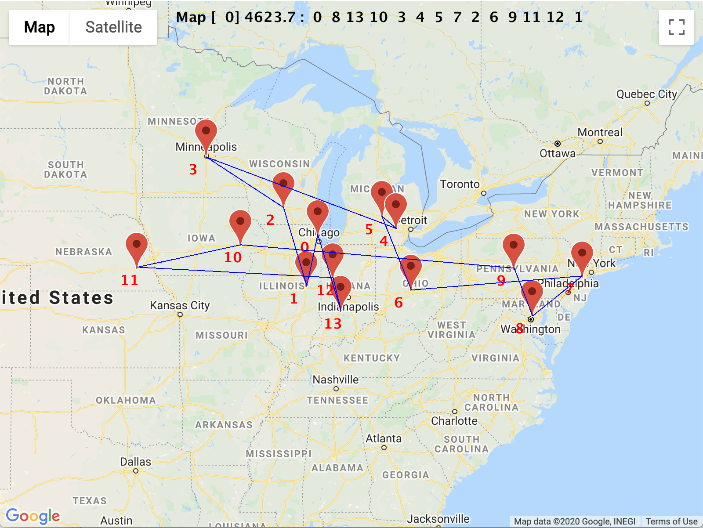

# Traveling Student Lab

_Inspired from “A GA to Solve the TSP” by Raja Sooriamurthi_


## Challenge

You plan to visit all fourteen schools in the Big Ten Conference over winter break. You will be driving and want to do this as efficiently (i.e., minimize the total distance traveled) as possible. You plan to start at Northwestern and return to Northwestern. What is the best tour (sequence of schools)? How hard can this be to solve?


## Complexity Theory

In Computer Science, problems are categorized based on their difficulty (time and/or space to solve)[^1]


* **P**: Problems that can be solved in polynomial time. Examples: multiplication, Game of Life, greatest common divisor (GCD), searching, sorting, 3x3 Rubik's Cube
* **NP**: Problems that cannot be solved in polynomial time but whose solutions can be verified in polynomial time. Examples: prime factorization, jigsaw, protein folding
* **NP-hard**: Problems that are at least as hard as the hardest problems In NP. Problems that are NP-hard do not have to be elements of NP. Examples: **Traveling Salesperson**, Magic: The Gathering, Chess, Go
* **NP-complete**: Problems that contain the hardest problems in NP. Each NP-complete problem has to be in NP. Examples: general Sudoku (n<sup>2</sup>xn<sup>2</sup> grids of nxn blocks), Candy Crush

For more details check out these videos:


* [P vs. NP and the Computational Complexity Zoo](https://www.youtube.com/watch?v=YX40hbAHx3s)
* [P vs. NP - An Introduction](https://www.youtube.com/watch?v=OY41QYPI8cw&list=PLlwsleWT767dnN25K_QgvdKkovK_t4K6-&index=3&t=0s)

The challenge that you will be solving in this lab is the Traveling Salesperson Problem, which is an NP-hard problem.


## Genetic Algorithms

There are a variety of algorithms that tackle the Traveling Salesperson Problem. In this lab, we will be using a genetic algorithm.

Read [this chapter](https://drive.google.com/file/d/1Q78AFV9U44bLCqFIAM8fZMCWmcbmrEBv/view?usp=sharing) from A.K.Dewdney's The New Turing Omnibus. The essential high-level structure of applying a genetic algorithm to solve a problem consists of:


1. determine a way to encode a representation for a solution
2. determine a fitness function (how to compare two candidate solutions)
3. create an initial population of random individuals
4. REPEAT
    1. SELECT two parents from the population pool
    2. CROSSOVER (reproduce) the parents to produce two children
    3. probabilistically MUTATE the children
    4. collect the children in a new pool
5. UNTIL
    5. the fitness of the best individual doesn't improve (or the average fitness of the pool as a whole doesn't improve)


## Academic Integrity


* You must complete this lab entirely on your own other than with the assistance of your teacher.
* You cannot discuss this lab with anyone else.
* You cannot receive assistance from or give assistance to anyone else.
* You may work on this lab outside of class.
* You may refer to class resources (e.g., notes, slides, live coding, practice programming activities, previous labs).


## Requirements


* Iteratively and incrementally implement this lab in the order specified and verify that you have met each milestone. While the milestones are organized such that multiple methods are tested, you are encouraged to iteratively and incrementally run the corresponding test method after implementing each method within that milestone.
* Commit to GitHub, at least daily, and at least once for each milestone, with a meaningful commit message describing what you accomplished and what needs to be done next.
* Answer the analysis questions.


## Class Overview


### TravelingStudent

This is the main class of the application. _It is implemented for you; you do not need to change it in order to complete the lab._ It is responsible for creating the window for the application and adding the Map object (see below) to the window. It is also responsible for repeatedly performing the genetic algorithm. Study the `run` and `performGeneticAlgorithm` methods for details. While this class performs the genetic algorithm, the specifics are handled by the `Tour` class.


### BigTenData

This static class has the static methods to get the array of cities in the Big Ten Conference and the corresponding distance matrix. _It is implemented for you; you do not need to change it in order to complete the lab._


### City

This class models a city with latitude, longitude, school name, and city name attributes. You will implement the entire City class as specified in this documentation:


```
    public City(double initialLat,
                double initialLng,
                String initialSchName,
                String initialCityName)
```

Constructs a new City object.
Parameters:
`initialLat` - the latitude of this city
`initialLng` - the longitude of this city
`initialSchName` - the name of the school in this city
`initialCityName` - the name of this city


```
    public double getLat()
```

Returns the latitude of this city


```
    public double getLng()
```

Returns the longitude of this city


```
    public String toString()
```

Returns a string with this city's name and associated school


### Map

This class is responsible for displaying the map and best current tour. _It is implemented for you; you do not need to change it in order to complete the lab._


### Tour

This class models a tour of cities in the Big Ten Conference. A tour is an ordered sequence of cities. For our challenge, a tour always starts at Northwestern. It is implied that a tour is a complete cycle and that after the last city is visited, we return to where we started (Northwestern). _All methods have headers and documentation, but you need to implement most of them._


### Util

This static class has a couple of static utility methods used by other classes. _Both methods have headers and documentation, but you need to implement them._

Carefully read the documentation for each method to understand its behavior. Pay particular attention to the postconditions, which specify what your implementation must ensure when the method returns. In addition, implementation suggestions are prefixed by "tip". While following these isn't required, it is encouraged and will simplify your implementation.


---


## Scoring

_This lab is split between the arrays unit and the final exam. The first three milestones are scored as part of your final exam. The last three milestones are scored as part of your summative lab for the arrays unit._


## Milestones


## _<span style="text-decoration:underline;">TODO:</span>_ implement `Util` class

In the `Util` class, Implement the:


1. `randRange` method
2. `count` method


## _<span style="text-decoration:underline;">MILESTONE 1:</span>_ `UtilTest` unit test

Run tests several times. Verify that the following tests always pass:


* `UtilTest.testRandRange`
* `UtilTest.testCount`


---


## _<span style="text-decoration:underline;">TODO:</span>_ implement `City` class

Implement the `City` class as documented in the above Class Overview section. You do not need to write JavaDoc comments for this class.


## _<span style="text-decoration:underline;">MILESTONE 2:</span>_ `Tour compilation`

Verify that the Tour class compiles.


---


## _<span style="text-decoration:underline;">TODO:</span>_ implement `Tour` class's constructors and `updateDistance` method

In the `Tour` class, Implement the:


1. default constructor
2. `updateDistance` method
3. copy constructor (i.e., `Tour(Tour tour)`)


## _<span style="text-decoration:underline;">MILESTONE 3:</span>_ `TourTest` unit test (part A)

Run tests several times. Verify that the following tests always pass:


* `TourTest.testDefaultConstructor`
* `TourTest.testUpdateDistance`
* `TourTest.testCopyConstructor`


---


## _<span style="text-decoration:underline;">TODO:</span>_ implement `Tour` class's factory method and mutation

In the `Tour` class, Implement the:


1. `swapRandTwo` method
2. `populateWithCities` method
3. `mutate` method


## _<span style="text-decoration:underline;">MILESTONE 4:</span>_ `TourTest` unit test (part B)

Run tests several times. Verify that the following tests always pass:


* `TourTest.testSwapRandTwo`
* `TourTest.testPopulateWithCities`
* `TourTest.testMutate`


---


## _<span style="text-decoration:underline;">TODO:</span>_ implement `Tour` class's `crossOver` method

In the `Tour` class, Implement the:


1. `crossOver` method

This is the most challenging method in the lab. The behavior of the method is captured with step-by-step comments of pseudocode in the method body. Focus on one step at a time. Steps 5 and 6 are completely implemented by the `replaceDuplicates` method which is already implemented. _Note that in the Dewdney article he talks about a novel encoding of tours that will ensure that we always get valid tours with crossover. We are not using that encoding. Rather ours is just a simple encoding of the actual sequence of cities visited in the tour._

Extension: Delete the provided implementation (but not the comments) of the `replaceDuplicates` method and implement it on your own based on the comments of pseudocode.


## _<span style="text-decoration:underline;">MILESTONE 5:</span>_ `TourTest` unit test (part C)

Run tests several times. Verify that the following tests always pass:


* `TourTest.testCrossOver`


---


## _<span style="text-decoration:underline;">TODO:</span>_ implement `Tour` class's `getCities` and `compareTo` methods

In the `Tour` class, Implement the:


1. `getCities` method
2. `compareTo` method


## _<span style="text-decoration:underline;">MILESTONE 6:</span>_ `TourTest` unit test (part D)

Run tests several times. Verify that the following tests always pass:


* `TourTest.testGetCities`
* `TourTest.testCompareTo`

All unit tests should pass at this point. Congratulations!


---


## System Test

The lab should now be complete and working. It is time to test the entire lab as a whole. Run the `main` method of the `TravelingStudent` class. The application will appear similar to the following:




There are several useful annotations made on the map:


* The best tour of the current generation is displayed at the top of the window. The format is the following: \
Map [ &lt;_generation_> ] &lt;_distance_> : &lt;_city index 0_> &lt;_city index 1_> &lt;_city index 2_> &lt;_city index 3_> ...
* Each school in the Big Ten Conference is marked with a standard Google Maps marker.
* The order of cities visited in the current best tour are numbered in red (0 through 13)
* The cities in the current best tour are connected with blue lines. While the lines are straight to simplify drawing, the distances are the actual distances as determined by Google Maps.

The map is updated for each generation to display the best tour of that generation. The application stops after 100 generations. The best tour will be displayed on the map.

In addition to the graphical display, additional information is printed to the terminal, which assists with analysis of the algorithm. The program first prints all of the Big Ten schools and their corresponding indices:


```
0: Northwestern (Evanston, IL)
1: Indiana (Bloomington, IN)
2: Maryland (College Park, MD)
3: Michigan (Ann Arbor, MI)
4: Michigan State (East Lansing, MI)
5: Ohio State (Columbus, OH)
6: Penn State (State College, PA)
7: Rutgers (New Brunswick, NJ)
8: Illinois (Champaign, IL)
9: Iowa (Iowa City, IA)
10: Minnesota (Minneapolis, MN)
11: Nebraska (Lincoln, NE)
12: Purdue (West Lafayette, IN)
13: Wisconsin (Madison, WI)
```


The program then prints the current generation and the top five tours of that generation. For each tour, the tour's distance followed by the city indices (order in which the cities are visit) are printed:


```
Gen: 0
0 4623.7 :  0  8 13 10  3  4  5  7  2  6  9 11 12  1
1 4666.0 :  0  3  9  8  1  5 12  2  7  6  4 11 10 13
2 4735.0 :  0  9 12  3  7  2  6  1  8 11 10 13  5  4
3 4854.0 :  0  1  6  2  7  4  5  3  8 13 10 12 11  9
4 4891.0 :  0  4  6  7  2  9 13 10 11  3  8  5 12  1

Gen: 1
0 4337.0 :  0 12  5  3  7  2  6  1  8 11 10 13  9  4
1 4537.7 :  0  8  9 11 12  1  6  7  2  5 10 13  3  4
2 4642.7 :  0 12  1 11  8  5  6  7  2  9 10 13  3  4
3 4645.7 :  0 12 13  5  3  4  6  7  2  8  9 10 11  1
4 4762.0 :  0 13 11  4 12  5  6  7  2  3  8  1 10  9

[...]
```


After 100 generations, the program prints the best tour's distance followed by the Big Ten schools in the order in which they are visited.


---


## _<span style="text-decoration:underline;">TODO:</span>_ Analysis:

Complete these analysis questions in the README.md file in the BlueJ project.


1. Run the program several times. Note the best tour after 100 generations for each run. Are they identical? If not, why doesn't the program find the same solution each time? Justify your answer.
2. Does the program find the best solution? Justify your answer.
3. If the program ran for 1000 generations instead of 100 generations, would it find a better solution? Justify your answer.


---


## _<span style="text-decoration:underline;">Extension:</span>_ Alternative Set of Cities

Perhaps you have different plans for spring break. Create a new class similar to `BigTenData` with your own set of cities and the corresponding distance matrix. The bigTen.html file interfaces with the Google Maps API to allow you to generate the latitude and longitude for your cities and the corresponding distance matrix. Before you can use this web app, you need to obtain an [API key](https://developers.google.com/maps/gmp-get-started). You then need to edit the bigTen.html file to specify your set of cities.


## _<span style="text-decoration:underline;">Extension:</span>_ Tune Genetic Algorithm

The size of the population, probability of mutation, and number of mutations in a child has a significant impact on the performance of the genetic algorithm. Tune the genetic algorithm such that it produces better solutions more often.


## _<span style="text-decoration:underline;">Extension:</span>_ Dynamic Completion

Instead of hardcoding the total number of generations that will be produced, continue to produce generations until the genetic algorithm is no longer productive. Decide how to quantify "no longer productive".


## _<span style="text-decoration:underline;">Extension:</span>_ Multiple Factor Score

Often in a genetic algorithm, multiple factors need to be balanced in the search for the best solution. In this lab, there was only one factor, the distance of the tour. Modify the Tour class such that two factors are balanced – the distance of the tour is minimized and the standard deviation of each segment (i.e., distance between two consecutive cities) is minimized. Weigh these factors equally.


## _<span style="text-decoration:underline;">Extension:</span>_ Google Maps API Integration

The data for this lab was captured using the Google Maps API. Use the [Directions service](https://developers.google.com/maps/documentation/javascript/directions) to display a map of the last generation's best tour with the actual routes displayed instead of straight lines. [This article](https://cloud.google.com/blog/products/maps-platform/how-calculate-distances-map-maps-javascript-api) may be helpful. Extend the program to generate an HTML file with the necessary JavaScript and HTML.


## _<span style="text-decoration:underline;">Extension:</span>_ Add More Awesome

Show me what you did!


---


## Submission


* Submit a link to your GitHub repository with this assignment.

<!-- Footnotes themselves at the bottom. -->
## Notes

[^1]:
     from: By Behnam Esfahbod, CC BY-SA 3.0, https://commons.wikimedia.org/w/index.php?curid=3532181


